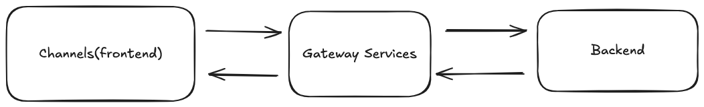
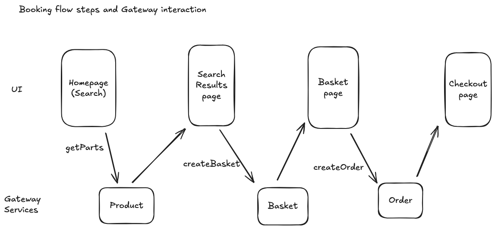

This solution follows the next basic integration

Channels(App, Web) will access the backend throught the gateway services. Having the Gateway Services layer allows the pure backend and frontend sides to be decoupled.
This way we can safely modificate the backend model without impacting the frontend, and viceversa

---
This is how the frontend would interact with the gateway services to show the customer the booking flow steps. There's a missing interaction with OrderService to "pay" on the checkout screen.

---

Due to family health issues, I haven't really had time to finalise the solution. I have added the main Backend and Gateway components to build it though. Let me answer the excercise questions here in text, hopefully we can dig into it more in a call. 

>"The product page: This would be a read operation, performed when you need to display the page of a product (a bicycle) for the customer to purchase. How would you present this UI? How would you calculate which options are available or not? How would you calculate the price depending on the customer's selections?"

Product page would be loaded by doing a call to the GatewayProductService,.getParts method. This would return a list on unfiltered parts, with enough information for the UI layer to mark as "sold out". The frontend could add filters to just populate specific parts. The UI could be a TableView or a List View of the different parts. Gateway Product Service could also have methods to just return parts that are compatible with an already selected part. ProductGatewayService.createProduct and ProductGatewayService.validateProduct method would be a bridge to the Backend.ProductService, where the logic to determine if a bicycle is valid and calculate the right price given a list of valid parts.

>"The "add to cart" action: Following the previous point, the product page should have a button to "add to cart" after the customer has made some specific selection. What happens when the customer clicks this button? What is persisted in the database?"

Add to Cart would create a new Product, that would later be added to a basket(in the basket page). When the user has added all the parts, a product would be created and validated through ProductGatewayService. The backend database would persist a product with the list of selected parts.

>The description of the main workflows from the administration part of the website, where Marcus configures the store.

I assumed that there would be a UI on the frontend for the administrator to add parts, price Rules and Part constraints. This would be done through the ProductGatewayService. On the Frontend and Gateway layers I assumed that Product is the main domain that would include everything related to parts.

The creation of a new product: What information is required to create a new product? What changes in the database after performing this action?

Mainly the list of parts, the price rules between those parts and the constraints to only use compatible parts. As every other model items, it would have a unique identifier.

>The addition of a new part choice: How can Marcus introduce a new rim color, for example? Can you describe the UI? What changes in the database after this action?

On this rushed solution, different colours would translate into different parts. So adding a new colour means creating a new Rim part for that colour. The UI for this would be a form where the details of the part could be added. It would use GatewayPartService.addPart, GatewayPartService.addPriceRule and GatewayPartService.addConstraint methods if special pricing or incompatibility with other parts are necessary. The Part, PriceRule and Constraint backend Database tables would be updated accordingly.

>Setting up prices: How can Marcus change the price of a specific part (like the diamond frame type) or specify that some combinations of choices have particular prices? How does the UI look? How does the database change to store this information?

I haven't implemented nor drafted this due to lack of time, but I would use the GatewayPartService for this as well, in a similar fashion than the "create part" use case. GatewayPartService would be the bridge between the Frontend and the Backend, where the data would be persisted.
